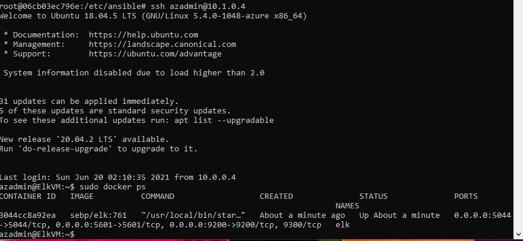
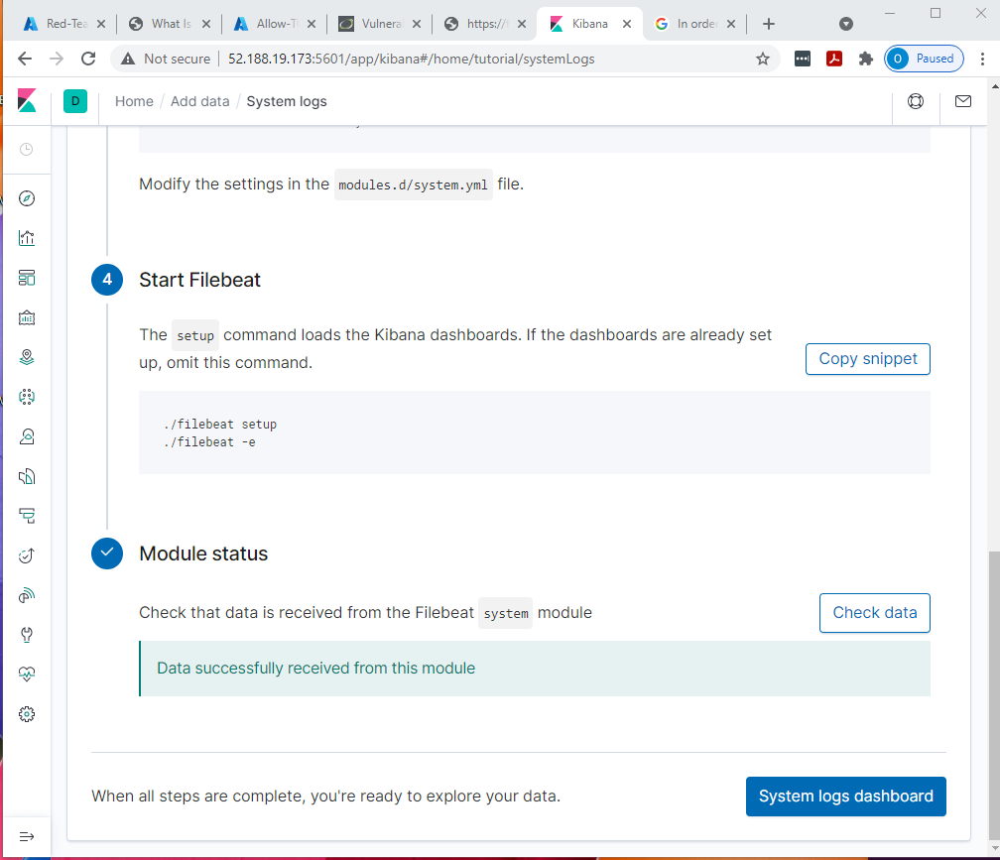
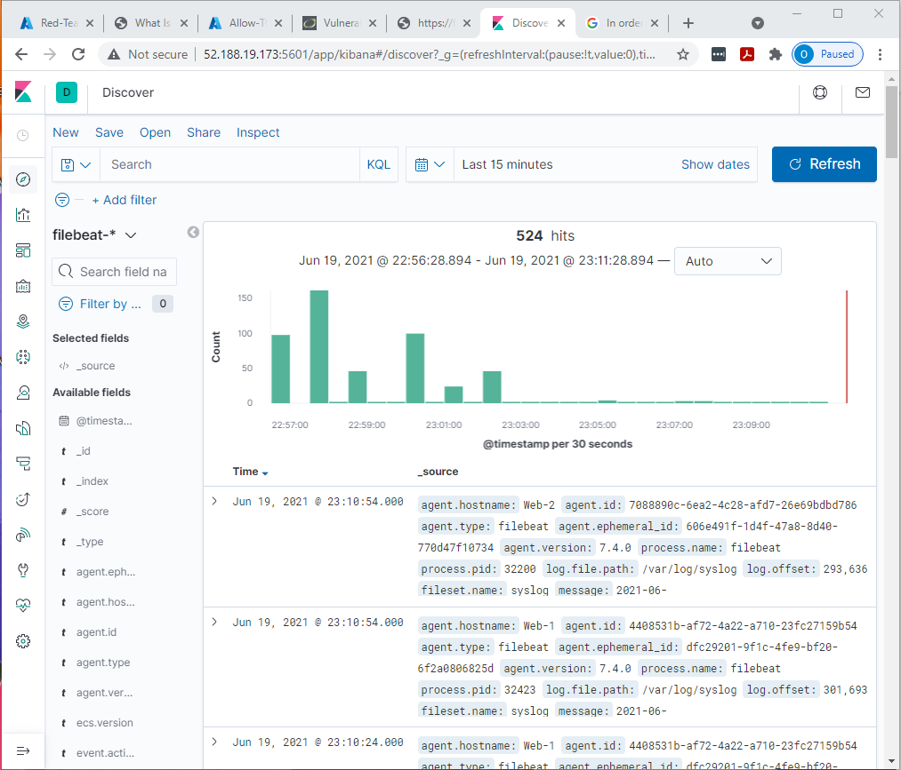
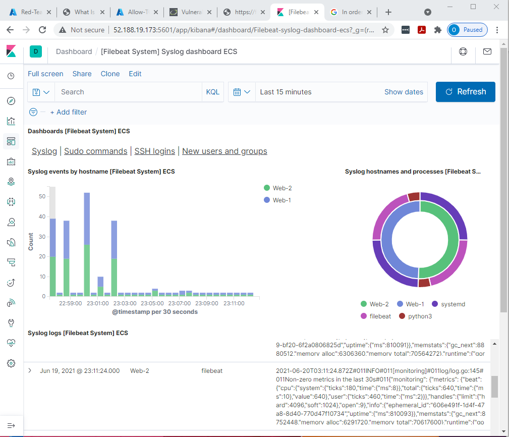

## Automated ELK Stack Deployment

The files in this repository were used to configure the network depicted below.
 

These files have been tested and used to generate a live ELK deployment on Azure. They can be used to recreate the entire deployment pictured above. Alternatively, select portions of the YML file may be used to install only certain components, such as Filebeat.

Files:
- [install-elk](https://github.com/oflore12/ELK-Stack-Deployment/blob/main/Ansible/install-elk.yml)
- [filebeat-playbook](https://github.com/oflore12/ELK-Stack-Deployment/blob/main/Ansible/filebeat-playbook.yml)
- [metricbeat-playbook](https://github.com/oflore12/ELK-Stack-Deployment/blob/main/Ansible/metricbeat-playbook.yml)

This document contains the following details:
- Description of the Topology
- Access Policies
- ELK Configuration
   - Beats in Use
   - Machines Being Monitored
- How to Use the Ansible Playbook

### Description of the Topology
The main purpose of this network is to expose a load-balanced and monitored instance of DVWA, the D*mn Vulnerable Web Application.

Load balancing ensures that the application is highly efficient and helps to mitigate DoS attacks on the network.

The load balancer protects the availability aspect of security by ensuring that traffic is distributed across multiple servers and by mitigating DoS attacks. Some advantages of having a jump-box include the added layer of security for anyone trying to access the servers directly and easier manipulation and configuration of all servers.

Integrating an ELK server allows users to easily monitor the vulnerable VMs for changes to the jump-box and system networks.
- What does Filebeat watch for?
   - Filebeat collects data about the file system. The log files collected are from those generated by Apache, Microsoft Azure tools, the Nginx web server, and MySQL databases.
- What does Metricbeat record?
   - Metricbeat collects machine metrics, such as uptime.

The configuration details of each machine may be found below.

| Name     | Function  | IP Address | Operating System |
|----------|-----------|------------|------------------|
| Jump Box | Gateway   | 10.0.0.4   | Linux            |
| Web-1    | Server    | 10.0.0.5   | Linux            |
| Web-2    | Server    | 10.0.0.6   | Linux            |
| ElkVM    |Log Server | 10.1.0.4   | Linux            |

### Access Policies
The machines on the internal network are not exposed to the public Internet. Only the ElkVM machine can accept connections from the Internet. Access to this machine is only allowed from the following IP address: 73.212.151.158.

Machines within the network can only be accessed by the jump-box-provisioner. The machines allowed access to the ELK VM are the private workstation with IP address 73.212.151.158 and the jump-box with IP address 10.0.0.4.

A summary of the access policies in place can be found in the table below:

| Name     | Publicly Accessible | Allowed IP Addresses    |
|----------|---------------------|-------------------------|
| Jump Box | Yes                 | 73.212.151.158          |
| Web-1    | No                  | 10.0.0.4                |
| Web-2    | No                  | 10.0.0.4                |
| ElkVM    | Yes                 | 73.212.151.158,10.0.0.4 |
|Load Balancer| Yes              | Any                     |

### Elk Configuration
Ansible was used to automate the configurations of the ELK machine. No configuration was performed manually, which is advantageous due to its flexibility. Using an Ansible playbook allows for customized configuration based on the server's needs.

The playbook implements the following tasks:
- Install Docker
- Install python3-pip
- Install Docker modules
- Increase virtual memory
- Use more memory
- Download and launch the Docker ELK container
- Enable service on boot
The following screenshot displays the result of running docker ps after successfully configuring the ELK instance:

### Target Machines & Beats
This ELK server is configured to monitor the following machines:
- 10.0.0.5
- 10.0.0.6

We have installed the following Beats on these machines:
- Filebeat
- Metricbeat

These Beats collect the following information from each machine:
- Filebeat logs information about the file system, specifically which files have been changed and when.
- Metricbeat collects metrics from the system and the services running on each server.

### Using the Playbook
To use the playbook, you need to have an Ansible control node already configured. Assuming you have such a control node provisioned, follow these steps:

- SSH into the control node.
- Copy the `filebeat-config.yml` file to the files directory.
- Update the `filebeat-config.yml` file to include the IP address of the ELK VM.
- Run the playbook and navigate to Kibana to check that the installation worked as expected.

The file of playbook is `/etc/ansible/files/filebeat-config.yml` and the file gets copied to `/etc/filebeat/filebeat.yml`

To update Ansible to run the playbook on a specific machine, edit **filebeat-playbook.yml**. Specify the `hosts` to install the playbook at the beginning of the YML document. Adding `webservers` ensures that the playbook is installed on the web-1 and web-2 servers. To add the ELK machine, add `elk`.

To add a `group`, edit the host file and add the IP address of the machine to the group.

- The URL to check that the ELK-Server is running is:
   - http://[ELK_MACHINE_PUBLIC_IP_ADDRESS]/app/kibana
     - (e.g., http://52.188.19.173:5601/app/kibana).

**NOTE:** Update [ELK_MACHINE_PUBLIC_IP_ADDRESS] with your ELK machine's public IP address.

### Bonus: Specific s
To download the playbook and update the files, run the following commandss:
- command: `curl https://gist.githubusercontent.com/slape/5cc350109583af6cbe577bbcc0710c93/raw/eca603b72586fbe148c11f9c87bf96a63cb25760/Filebeat > filebeat-config.yml`
- command: `nano filebeat-config.yml`
- update the following lines to include the ELK server IP
  - `hosts: ["10.1.0.4:9200"]` (change line #1106)
  - `host: "10.1.0.4:5601"`(line #1806)
- command: `nano filebeat-playbook.yml`
- [Use this yml file to create the filebeat playbook](https://github.com/oflore12/ELK-Stack-Deployment/blob/main/Ansible/filebeat-playbook.yml)
- save the file
- command: `ansible-playbook filebeat-playbook.yml`

### Photos
- Successful Filebeat playbook
  

- URL used to check if Filebeat is working properly
  

- Logs reported by the Filebeat playbook
  

- Syslog events reported by Filebeat
  

Repeat the steps for Metricbeat using the following URL for the curl : `curl https://gist.githubusercontent.com/slape/58541585cc1886d2e26cd8be557ce04c/raw/0ce2c7e744c54513616966affb5e9d96f5e12f73/metricbeat`

[This project was worked on during enrollment to GW Cybersecurity Boot Camp Program 2021]
